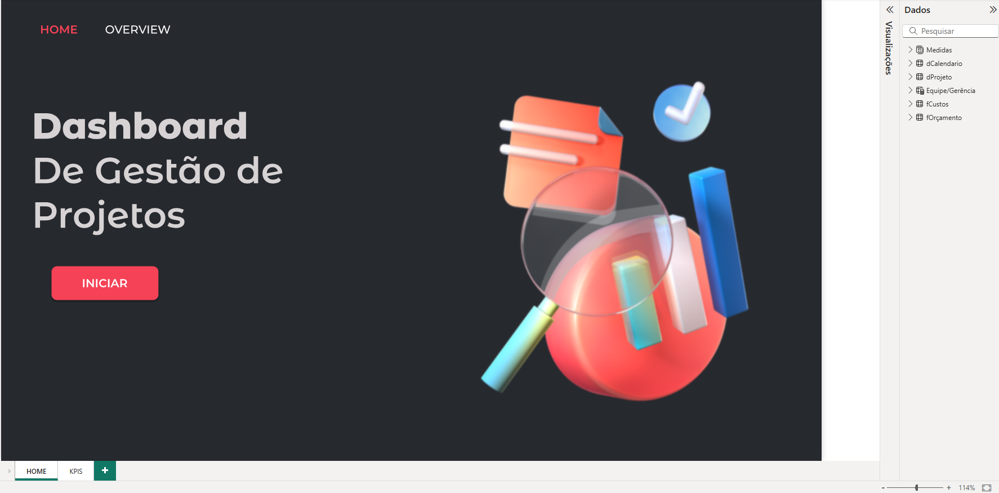
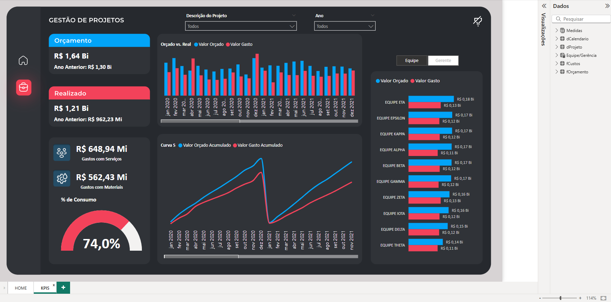

# 📊 Dashboard sobre Gestão de Projetos

## 📌 Sobre o Projeto

O principal objetivo deste dashboard é oferecer uma visualização clara e objetiva da performance de gestão de projetos utilizando dados fictíctios extraídos da internet, considerando fatores como prazos, custos, e alocação de recursos. Além disso, o dashboard inclui comparativos entre os valores orçados e realizados ao longo do tempo, de modo a identificar desvios e propor soluções proativas.

## 🚀 Etapas da construção do Dashboard e Resultados:

- **Coletar e Organizar os dados**;
- **Desenvolvimento dos Indicadores-Chave (KPIs)**;
- **Gráficos Interativos**;
- **Criação da Curva S**;
- **Análise e Interpretação dos Resultados**;

## 📸 Demonstração

Aqui está uma prévia do dashboard em funcionamento:

